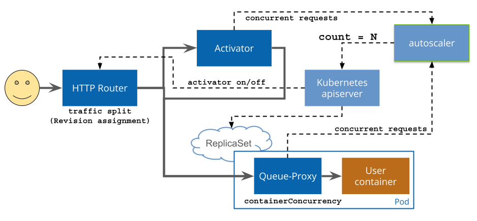

# HTTP Request Flows

While [the overview](/docs/serving) describes the logical components of Knative
Serving, this page explains the behavior and flow of HTTP requests to an
application which is running on Knative Serving.

The following diagram shows the different request flows and control plane loops for Knative Serving.  Note that some components, such as the autoscaler and the apiserver are not updated on every request, but instead measure the system periodically (this is referred to as the control plane).

<!-- Image original: https://docs.google.com/drawings/d/1Jipg4755BHCyqZGu1sUj7FMFUpEs-35Rf5T5chHZ6m0/edit -->

The HTTP router, activator, and autoscaler are all shared cluster-level
resources; this reduces the overhead for a new Knative service to only metadata
when the Service is not in use, and allows more efficient management and upgrade
of these shared components.

Routing decisions are made once on a per-request level at the HTTP Router (the
pluggable ingress layer), and are recorded on the request in an internal header.
Once a request has been assigned to a Revision, the subsequent routing depends
on the measured traffic flow; at low or zero traffic, incoming requests are
routed to the activator, while at high traffic levels ([spare capacity greater
than `target-burst-capacity`](../../load-balancing/target-burst-capacity))
traffic is routed directly to the application pods.

## Scale From Zero

When there is low or zero traffic to a particular Revision, the HTTP router
sends traffic to the activator, including a header indicating the selected
Revision.  The activator serves as a buffer or queue for incoming requests -- if
a request is routed to a Revision which does not currently have available
capacity, the activator delays the request and signals to the autoscaler that
additional capacity is needed.

When the autoscaler detects that the available capacity for a Revision is below
the requested capacity, it [increases the number of pods requested from
Kubernetes](../../autoscaling/autoscale-go#algorithm).

When these new pods become ready or an existing pod has capacity, the activator
will forward the delayed request to a ready pod.  If a new pod needs to be
started to handle a request, this is called a _cold-start_.

## High scale

When a Revision has a high amount of traffic ([the spare capacity is greater
than `target-burst-capacity`](../../load-balancing/target-burst-capacity)), the
ingress router is programmed directly with the pod adresses of the Revision, and
the activator is removed from the traffic flow.  This reduces latency and
increases efficiency when the additional buffering of the activator is not
needed.  In all cases, the queue-proxy remains in the request path.

If traffic drops below the burst capacity threshold (calculated as:
`current_demand + target-burst-capacity > (pods * concurrency-target)`), then
the ingress router will be re-programmed to send traffic to the activator pods.

Routing traffic between ingress and activators is done by writing a subset of
the activator endpoints into the Endpoints for the Revision's Service.  The
Kubernetes Service corresponding to the revision is
[selectorless](https://kubernetes.io/docs/concepts/services-networking/service/#services-without-selectors), and may either contain the Revision's pod endpoints or the activator endpoints.  The use of a selectorless service is for the following reasons:

* Some ingress implementations do not allow cross-namespace service references.
  The activator runs in the `knative-serving` namespace.
  
* Some ingress implementations do not handle changing the backing Kubernetes
  Service of a routing endpoint seamlessly.

* By using subsetting on a per-Revisino basis, incoming requests are funneled to
  a small number of activators which can more efficiently make ready/not-ready
  capacity decisions.  The small number of effective activators per Revision is
  not a scaling problem because the activators will be removed from the request
  path when the Revision scales up to receive more traffic.

## Queue-Proxy

The queue-proxy component implements a number of features to improve the
reliability and scaling of Knative:

* Measures concurrent requests for the autoscaler, particularly when the
  activator is removed from the request path.

* Implements the [`containerConcurrency` hard limit on request
  concurrency](https://knative.dev/docs/serving/autoscaling/concurrency/#hard-limit)
  if requested.

* Handles graceful shutdown on Pod termination (refuse new requests, fail
  readiness checks, continue serving existing requests).

* Reports HTTP metrics and traces from just outside the user container, so that
  the infrastructure latency contribution can be measured.